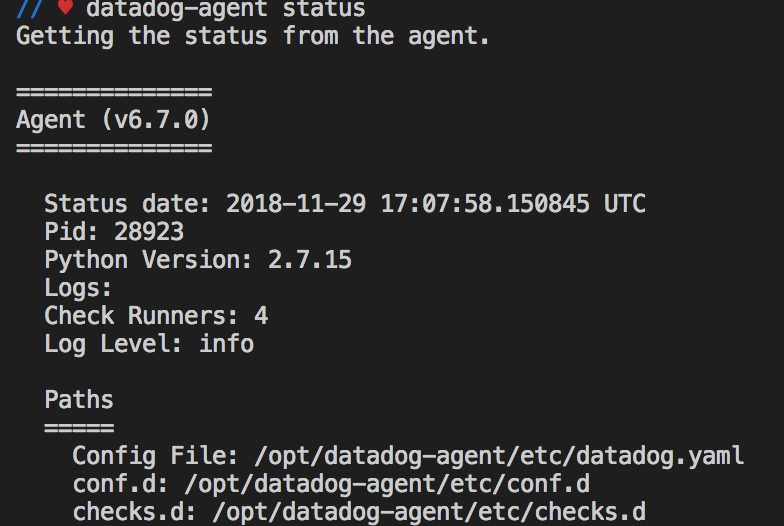
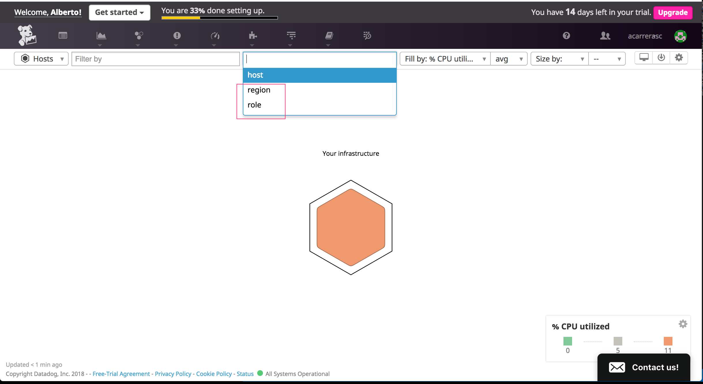

Your answers to the questions go here.

## Prerequisites - Setup the environment

- [x] Sign up for Datadog (use “Datadog Recruiting Candidate” in the “Company” field).
- Successfully signed up for Datadog on https://app.datadoghq.com/signup
- [x] Get the Agent reporting metrics from your local machine.
In order to get the Datadog Agent reporting metrics from my local machine, I first installed  Agent directly in my local machine (macOS) without VB or containers. 

1. Datadog Agent installation. 
After selecting macOS as the platform for installation (R1), I followed the installation instructions (R2). On my terminal, I run the following command which included my Datadog API key. The installation run automatially

`$ DD_API_KEY=04b457d18fc4f92ecd500f802a01449d bash -c "$(curl -L https://raw.githubusercontent.com/DataDog/datadog-agent/master/cmd/agent/install_mac_os.sh)"`

The installation run automatically, and prompted the following success message:

*Your Agent is running properly. It will continue to run in the background and submit metrics to Datadog. You can check the agent status using the ##datadog-agent status## command or by opening the webui using the ##datadog-agent launch-gui## command. If you ever want to stop the Agent, please use the Datadog Agent App or the launchctl command. It will start automatically at login.*

2. Datadog agent status
I checked Datadog agent status run the following command in terminal.
`$ datadog-agent status` 

3. Datadog agent GUI 
In order to access the agent's GUI, in the terminal I run the following command. 
`$ datadog-agent launch-gui` 
The GUI successfully opens on http://127.0.0.1:5002/ 

**RESOURCES** 
R1 - Datadog agent documentation: https://docs.datadoghq.com/agent/basic_agent_usage/osx/
R2 - Datadog Agent Installing on macOS documentation: 
https://app.datadoghq.com/account/settings#agent/mac

https://datadog.github.io/summit-training-session/handson/customagentcheck/

## Collecting Metrics
- [x] Add tags in the Agent config file and show us a screenshot of your host and its tags on the Host Map page in Datadog.

1. As detailed in documentation (R3), the configuration files and folders for the Agent are located in *~/.datadog-agent/datadog.yaml*
In order to access the Agent configuration files, I run 
`$ vim ~/.datadog-agent/datadog.yaml` or 
`$ sublime ~/.datadog-agent/datadog.yaml`

2. Once inside the file, I added tags following the documentation. First uncommented the tags section code and added tags following the documentation guidelines (R4, R5) modifying the code as follows:
`tags: region:USEast, role:localmachine`

After saving the changes in the file, the changes are also visible (and editable) from the Agent GUI.

Then, I restarted agent following the agent commands documentation (R6). In the terminal, I run the following stop/start commands. 
`$ launchctl stop com.datadoghq.agent`
`$ launchctl start com.datadoghq.agent`

After restarting the agent, I checked the tags were showing on host map page.

**RESOURCES** 
R3 - Datadog Agent Usage on macOS documentation:https://docs.datadoghq.com/agent/basic_agent_usage/osx/?tab=agentv6
R4 -  Tags documentation: https://docs.datadoghq.com/tagging/
R5 -  Assigning tags documentation: https://docs.datadoghq.com/tagging/assigning_tags/?tab=go#configuration-files
R6 -  Agent command documentation: https://docs.datadoghq.com/agent/faq/agent-commands/?tab=agentv6

https://docs.datadoghq.com/agent/faq/agent-configuration-files/?tab=agentv6

- [x] Install a database on your machine (MongoDB, MySQL, or PostgreSQL) and then install the respective Datadog integration for that database.

**RESOURCES** 
https://docs.datadoghq.com/integrations/postgres/
https://www.datadoghq.com/blog/collect-postgresql-data-with-datadog/
http://tutorials.jumpstartlab.com/topics/vagrant_setup.html

- [x] Create a custom Agent check that submits a metric named my_metric with a random value between 0 and 1000.

- [x] Change your check's collection interval so that it only submits the metric once every 45 seconds.

### Bonus Question
Can you change the collection interval without modifying the Python check file you created?

## Visualizing Data

- [x] Utilize the Datadog API to create a Timeboard that contains:

1. Your custom metric scoped over your host.
2. Any metric from the Integration on your Database with the anomaly function applied.
3. Your custom metric with the rollup function applied to sum up all the points for the past hour into one bucket

NOTE: Please be sure, when submitting your hiring challenge, to include the script that you've used to create this Timeboard.

**RESOURCES** 
https://docs.datadoghq.com/api/?lang=ruby#overview
https://docs.datadoghq.com/api/?lang=ruby#create-a-timeboard
https://docs.datadoghq.com/graphing/
https://help.datadoghq.com/hc/en-us/articles/115002182863-Using-Postman-With-Datadog-APIs

- [x] Once this is created, access the Dashboard from your Dashboard List in the UI:
1. Set the Timeboard's timeframe to the past 5 minutes
2. Take a snapshot of this graph and use the @ notation to send it to yourself.

### Bonus Question
What is the Anomaly graph displaying?

## Monitoring Data
- [x] Create a new Metric Monitor that watches the average of your custom metric (my_metric) and will alert if it’s above the following values over the past 5 minutes:
1. Warning threshold of 500
2. Alerting threshold of 800
3. And also ensure that it will notify you if there is No Data for this query over the past 10m.

**RESOURCES** 
https://docs.datadoghq.com/monitors/monitor_types/metric/
https://docs.datadoghq.com/monitors/notifications/?tab=is_alertis_warning#variables

- [x] Please configure the monitor’s message so that it will:

1. Send you an email whenever the monitor triggers.
2. Create different messages based on whether the monitor is in an Alert, Warning, or No Data state.
3. Include the metric value that caused the monitor to trigger and host ip when the Monitor triggers an Alert state.
4. When this monitor sends you an email notification, take a screenshot of the email that it sends you.

### Bonus Question
Since this monitor is going to alert pretty often, you don’t want to be alerted when you are out of the office. Set up two scheduled downtimes for this monitor: One that silences it from 7pm to 9am daily on M-F,And one that silences it all day on Sat-Sun. Make sure that your email is notified when you schedule the downtime and take a screenshot of that notification.

## Collecting APM Data
- [x] Given the following Flask app (or any Python/Ruby/Go app of your choice) instrument this using Datadog’s APM solution. 

**RESOURCES** 
https://docs.datadoghq.com/tracing/setup/?tab=agent630
https://docs.datadoghq.com/tracing/setup/ruby/
git 
https://github.com/DataDog/datadog-trace-agent/releases/tag/6.7.0

1. Provide a link and a screenshot of a Dashboard with both APM and Infrastructure Metrics.
2. Please include your fully instrumented app in your submission, as well.

### Bonus Question
What is the difference between a Service and a Resource?
**Answer**
https://docs.datadoghq.com/tracing/visualization/

### Final Question
Datadog has been used in a lot of creative ways in the past. We’ve written some blog posts about using Datadog to monitor the NYC Subway System, Pokemon Go, and even office restroom availability! Is there anything creative you would use Datadog for?

